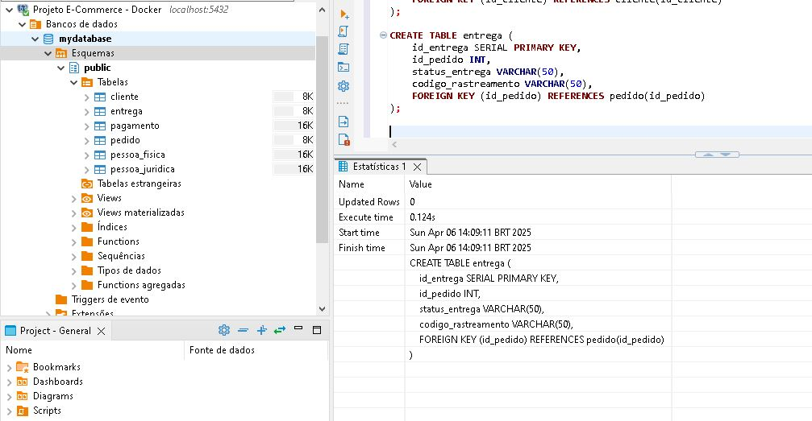
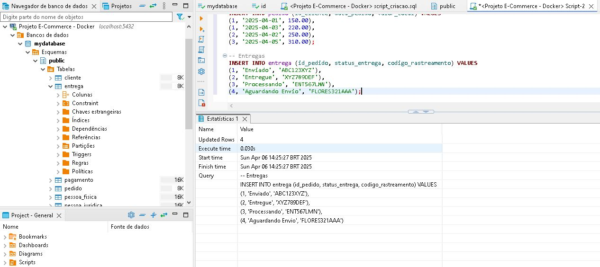
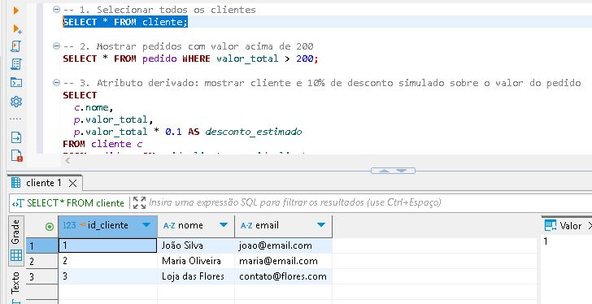
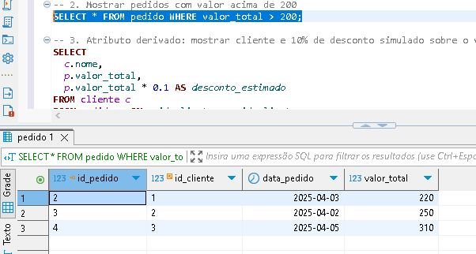
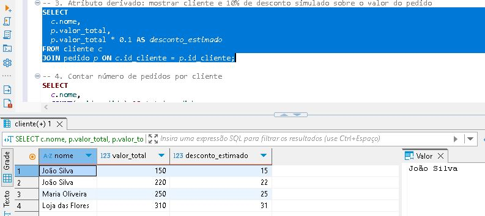
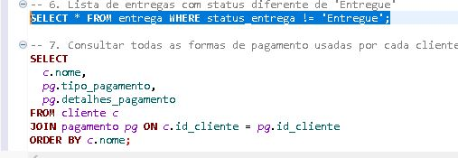

# 💻 Projeto Lógico de Banco de Dados - E-Commerce (PostgreSQL + Docker)

Este repositório contém a modelagem lógica de um banco de dados relacional para um sistema de **e-commerce**, desenvolvido como parte do desafio da DIO no bootcamp de **Inteligência Artificial Aplicada a Dados com Copilot**.

O projeto foi implementado com **PostgreSQL** via Docker e os scripts foram testados com a interface do **DBeaver**.

---

## 📌 Descrição do Desafio

Refaça a modelagem lógica de um banco de dados relacional para um sistema de e-commerce, com os seguintes pontos:

- Clientes podem ser Pessoa Física ou Jurídica, mas não ambas
- Pagamento pode ter mais de uma forma cadastrada
- Entrega deve ter status e código de rastreamento

Implemente a criação do esquema em SQL, insira dados de teste e desenvolva consultas com:
- `SELECT`, `WHERE`, `ORDER BY`
- Atributos derivados
- `JOIN`, `GROUP BY`, `HAVING`


## 📁 Estrutura do Projeto

```
ecommerce-db-logico/
├── docker-compose.yml
├── Script/
│   ├── script_criacao.sql
│   ├── script_inserts.sql
│   └── queries_testes.sql
├── Imagens/
│   ├── Etapa_de_criação_tabelas.jpg
│   ├── insercao_dados_entrega.jpg
│   └── consulta/
│       ├── clientes_todos.jpg
│       ├── pedidos_acima_200.jpg
│       ├── clientes_desconto.jpg
│       ├── entregas_status_diferente.jpg
```

---

## 🚀 Como Executar com Docker

1. Certifique-se de que você tem o **Docker** instalado.
2. Rode o comando:

```bash
docker-compose up -d
```

3. Acesse o pgAdmin em `http://localhost:5050`
   - Email: `admin@admin.com`
   - Senha: `admin`
   - Conecte ao host `ecommerce_postgres`, database: `mydatabase`, user: `admin`, password: `admin`

4. Execute os scripts em `/Script/` na ordem:
   - `script_criacao.sql`
   - `script_inserts.sql`
   - `queries_testes.sql`

---

## 📸 Prints das Etapas

### 📌 Criação das Tabelas


### 📌 Inserção de Dados e Entregas


### 📌 Consultas SQL com Resultados

| Consulta | Imagem |
|---------|--------|
| Todos os clientes |  |
| Pedidos com valor > 200 |  |
| Desconto estimado por pedido |  |
| Entregas com status diferente de 'Entregue' |  |

---

## 📚 Conteúdo Desenvolvido

- Modelagem lógica com chaves primárias e estrangeiras
- Criação de tabelas normalizadas
- Inserção de dados com integridade referencial
- Consultas SQL com `JOIN`, `WHERE`, `GROUP BY`, `HAVING`, `ORDER BY`
- Ambiente replicável via Docker

---

## 🧠 Autor

Desenvolvido por João F. como parte do bootcamp da DIO.  
Este projeto simula um banco realista para operações de um sistema e-commerce.

---
